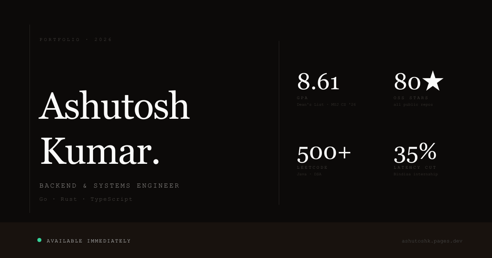

# ashutosh kumar

**[ashutoshk.pages.dev](https://ashutoshk.pages.dev)** — personal portfolio & writing.

Backend engineer. Building systems in Go, Rust, and TypeScript.  
MUJ CS '26 · Available immediately.

---

## what's inside

```
src/
├── lib/
│   ├── components/     # Nav, Hero, FeaturedProject, SkillGrid, …
│   ├── content/        # profile, projects, skills, experience (edit here)
│   └── types.ts
├── posts/              # blog posts in .svx (mdsvex)
└── routes/             # +page.svelte, writing/[slug], rss.xml
static/
├── og.png              # generated by scripts/og.mjs at build time
└── ashutosh-kumar.pdf  # résumé
```

## stack

| | |
|---|---|
| **Framework** | SvelteKit 2 · Svelte 5 runes |
| **Styles** | Tailwind CSS v4 — no config file, `@theme {}` only |
| **Blog** | mdsvex — write `.svx`, get Svelte components inside markdown |
| **Deploy** | Cloudflare Pages · `adapter-cloudflare` |
| **OG image** | Generated from SVG at build time via `sharp` |

## local dev

```bash
npm install
npm run dev       # localhost:5173
npm run build     # prebuild generates og.png, then vite build
npm run preview   # preview production build locally
```

## deploy

```bash
npm run deploy
# → npm run build + wrangler pages deploy .svelte-kit/cloudflare
```

## updating content

All copy lives in `src/lib/content/` — no JSX, no CMS.

| File | What it controls |
|---|---|
| `profile.ts` | bio, stats band, AI section, hiring section |
| `projects.ts` | flagship + "also built" projects |
| `skills.ts` | skill tiers + milestones |
| `experience.ts` | work experience + education |

Add a blog post: drop a `.svx` file in `src/posts/` with frontmatter:

```md
---
title: "Post title"
date: "2026-04-16"
description: "One line."
tags: ["systems", "rust"]
---
```

---

[github.com/bravo1goingdark](https://github.com/bravo1goingdark) · [linkedin](https://linkedin.com/in/bravo1goingdark) · [x](https://x.com/bravo1goingdark)
